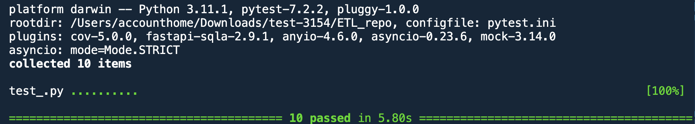
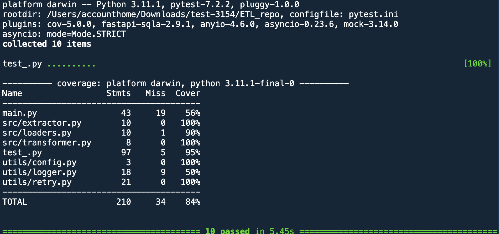
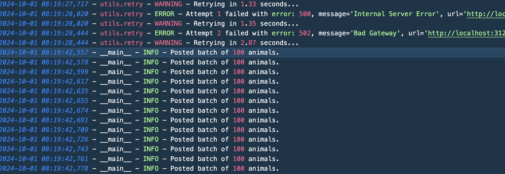
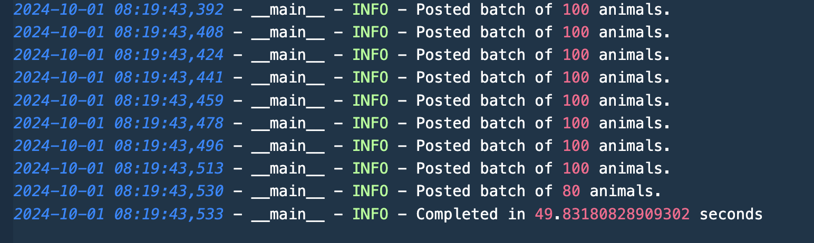

## Prerequisites

- Start by downloading the Docker image:
https://storage.googleapis.com/lp-dev-hiring/images/lp-programming-challenge-1-1625758668.tar.gz

- Load the container: docker load -i
lp-programming-challenge-1-1625758668.tar.gz.

- expose port 3123 so you can access it: docker run --rm -p 3123:3123 -ti lp-programming-challenge-1
 
- Open http://localhost:3123/ to see if things are working.


#### Local Setup
- Python 3.9
- pip


#### Installation Steps
1. Clone the repository:
   ```bash
   git clone <repository_url>
   ```

2. Navigate to the project directory:
   ```bash
   cd <project_directory>
   ```
3. Create virtual environment
    ```bash
    python -m venv venv
    ```
4. Activate virtual environment
    
    ```bash
    source venv/bin/activate # for mac and linux

    venv\Scripts\activate  # for Windows
    ```
5. Install dependencies:
   ```bash
   pip install -r requirements.txt
   ```

6. Run the  pplication:
   ```bash
   python main.py   
   ```

### Running Tests with pytest and Coverage
1. Run tests:
    ```bash
   pytest
    ```
2. View test coverage:
    ```bash
   pytest --cov
    ```

## Approach

**The ETL approach for given application:**
- Extract: Fetch paginated animal data from the API, retrieving detailed information for each animal asynchronously.
- Transform: Process the raw data by converting date formats, splitting strings, and restructuring fields to meet the required output format.
- Load: Batch the transformed data into groups of 100 and post them to the target API endpoint, ensuring reliability through retries and error handling during the upload.

## screenshots for testing and logging

- Test Cases
- 

- Test Coverage
- 

- Logging 
- 

- 

